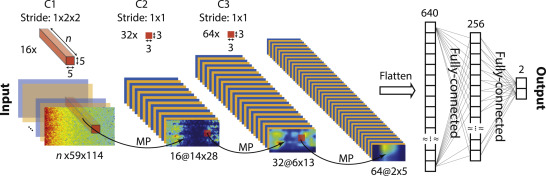

# Detecting Seizures using Convolutional Neural Networks
## Graduate Machine Learning (Fall 2019) Final Project

Seizures (Epileptic Seizures in specific) are the second most common neurological disorder and affect tens of millions of people each year. Seizure detection is generally a highly involved process requiring medical experts on hand. Automatic seizure detection has developed into an active area of research, but faces a number of difficulties. EEG (electroencephelogram) recordings are how brain activity is generally recorded for seizure detection. Automatic seizure detection generally relies on hand-crafted feature extraction from EEG data - a difficult and time-intensive process. Applying Machine learning techniques such as Convolutional Neural Networks could potentially do away with hand-crafted features, in favor of learned features. 

In order to pass our EEG data to a CNN, we first need to convert it into a spectrogram, which gives us a visual representation of frequency over time. Our network architecture will look like:

Code implementation based on following papers:
1) Truong, N., Nguyen, A., Kuhlmann, L., Bonyadi, M., Yang, J., Ippolito, S. and Kavehei, O. (2018). 
Convolutional neural networks for seizure prediction using intracranial and scalp electroencephalogram. 
Neural Networks, 105, pp.104-111.
and their code implementation:
https://github.com/NeuroSyd/seizure-prediction-CNN/

2) Zhou, M., Tian, C., Cao, R., Wang, B., Niu, Y., Hu, T., … Xiang, J. (2018). 
Epileptic Seizure Detection Based on EEG Signals and CNN. 
Frontiers in neuroinformatics, 12, 95. doi:10.3389/fninf.2018.00095

